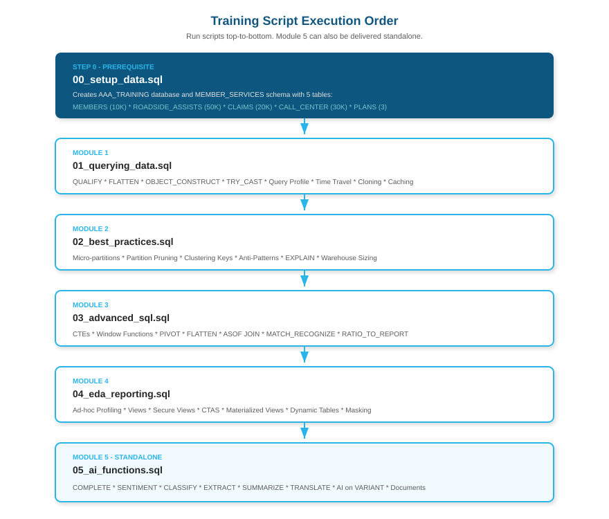

# Snowflake SQL Training — AAA


A complete half-day Snowflake SQL training package built for AAA technical staff. Covers Snowflake-specific SQL features, query optimization, advanced SQL patterns, exploratory data analysis, and Snowflake Cortex AI functions — all demonstrated against a realistic AAA-themed synthetic dataset.

Includes two standalone presentation decks: the core SQL training (28 slides) and an AI Functions deep-dive (18 slides) that can be delivered independently.

---

## Agenda (3.5 hours)

| Module | Topics | Duration |
|--------|--------|----------|
| **1 — Querying Data** | Snowflake SQL features, Query Profile, Time Travel, Zero-Copy Cloning, Caching | ~50 min |
| **2 — Query Best Practices** | Micro-partitions, pruning, clustering keys, anti-patterns, warehouse sizing | ~45 min |
| **3 — Advanced SQL** | CTEs (recursive), Window Functions, PIVOT/UNPIVOT, LATERAL FLATTEN | ~50 min |
| **4 — EDA and Reporting** | Ad-hoc analysis, reusable views, reporting datasets, governance intro | ~45 min |
| **5 — AI Functions** *(standalone)* | COMPLETE, SENTIMENT, CLASSIFY, EXTRACT on structured, semi-structured, and unstructured data | ~45 min |

---

## Repository Contents

```
snowflake-sql-training/
├── AAA_Snowflake_Training.pptx       # Core SQL training deck (28 slides)
├── AAA_AI_Functions_Training.pptx    # Standalone AI Functions deck (18 slides)
├── scripts/
│   ├── 00_setup_data.sql             # Creates AAA_TRAINING DB and populates sample data
│   ├── 01_querying_data.sql          # Module 1 demo script
│   ├── 02_best_practices.sql         # Module 2 demo script
│   ├── 03_advanced_sql.sql           # Module 3 demo script (incl. ASOF JOIN, MATCH_RECOGNIZE)
│   ├── 04_eda_reporting.sql          # Module 4 demo script
│   └── 05_ai_functions.sql           # Module 5 — Cortex AI Functions demos
├── Snowflake_Logo.svg
└── README.md
```

---

## Training Flow



---

## Quick Start

### 1. Prerequisites

- Snowflake account with `SYSADMIN` role (or ability to create databases/warehouses)
- Snowsight access for Query Profile demos

### 2. Set Up Sample Data

Run the setup script once before the training session. It creates a self-contained training database with five AAA-themed tables:

```sql
-- In Snowsight or a SQL client, execute:
-- scripts/00_setup_data.sql
```

This creates **`AAA_TRAINING.MEMBER_SERVICES`** with:

| Table | Rows | Purpose |
|-------|------|---------|
| `MEMBERSHIP_PLANS` | 3 | Reference plans with VARIANT `benefits` array |
| `MEMBERS` | ~10,000 | Members with `referral_member_id` for recursive CTE demo |
| `ROADSIDE_ASSISTS` | ~50,000 | Assists with VARIANT `weather` column for FLATTEN demos |
| `CLAIMS` | ~20,000 | Claims with VARIANT `adjuster_notes` |
| `CALL_CENTER_INTERACTIONS` | ~30,000 | Multi-channel interactions with CSAT scores |

Run time: ~60 seconds on an XS warehouse.

### 3. Run the Training

Open each script in Snowsight and run sections using the `-- DEMO:` markers as navigation guides. The presentation deck (`AAA_Snowflake_Training.pptx`) drives the discussion — switch to the worksheet to run the corresponding SQL demo.

---

## Module Details

### Module 1 — Querying Data (`01_querying_data.sql`)

- **QUALIFY** — filter window function results without a subquery
- **LATERAL FLATTEN** — unpack VARIANT JSON arrays into rows
- **OBJECT_CONSTRUCT** — build JSON from relational columns on the fly
- **TRY_CAST** — safe type conversion that returns NULL on failure (no errors)
- **Query Profile** — how to read partition pruning, spill, and cache metrics
- **Time Travel** — `AT(OFFSET)`, `AT(TIMESTAMP)`, `BEFORE(STATEMENT)`, `UNDROP TABLE`
- **Zero-Copy Cloning** — instant table/schema/database copies at zero storage cost
- **Caching** — metadata cache, result cache (24hr TTL), warehouse SSD cache

### Module 2 — Query Best Practices (`02_best_practices.sql`)

- **Micro-partitions** — how Snowflake stores data and tracks min/max metadata
- **Partition pruning** — selective predicates vs full scans, checking with Query Profile
- **Clustering keys** — `SYSTEM$CLUSTERING_INFORMATION`, when and how to pick a key
- **Common anti-patterns**:
  - `SELECT *` — reads all columns unnecessarily
  - Functions on filter columns — `YEAR(ts) = 2024` defeats pruning; use range predicates
  - `NOT IN` with NULLs — logical trap; use `NOT EXISTS` instead
  - Implicit cartesian joins — always use explicit `ON` conditions
- **EXPLAIN USING TABULAR** — reading estimated execution plans
- **Warehouse sizing** — XS through XL+, auto-suspend, spill detection

### Module 3 — Advanced SQL (`03_advanced_sql.sql`)

- **CTEs** — readability, chaining (multi-step pipelines), recursive (referral tree traversal)
- **Window Functions — Ranking**: `ROW_NUMBER`, `RANK`, `DENSE_RANK`, `NTILE`
- **Window Functions — Aggregate**: running totals, 3-month rolling averages, YoY comparison
- **Window Functions — Navigation**: `LAG`/`LEAD`, `FIRST_VALUE`/`LAST_VALUE`
- **Frame specifications**: `ROWS` vs `RANGE`, `UNBOUNDED PRECEDING`, interval frames
- **PIVOT / UNPIVOT** — reshape `issue_type` rows into columns and back
- **LATERAL FLATTEN** — deep dive into nested JSON arrays in VARIANT columns

### Module 4 — EDA and Reporting (`04_eda_reporting.sql`)

- **EDA patterns** — table profiling, percentile distributions, null audits, duplicate checks
- **`APPROX_COUNT_DISTINCT`** — HyperLogLog for fast cardinality estimation
- **Reusable Views** — `CREATE VIEW` (member 360), `CREATE SECURE VIEW` (hides DDL)
- **CTAS snapshots** — `CREATE TABLE AS SELECT` for point-in-time reporting datasets
- **Materialized Views** — auto-refreshed aggregations for read-heavy workloads
- **Dynamic Tables** — declarative incremental pipelines with `TARGET_LAG`
- **Column Masking Policies** — protect email/PII automatically by role

### Module 5 — AI Functions (`05_ai_functions.sql`) *(standalone deck available)*

- **CORTEX.COMPLETE** — general-purpose LLM inference on any text (member profiles, recommendations)
- **CORTEX.SENTIMENT** — score text from -1.0 to +1.0 (feedback, call topics)
- **CORTEX.CLASSIFY_TEXT** — zero-shot categorization into your labels (urgency routing)
- **CORTEX.EXTRACT_ANSWER** — question answering from free text (document Q&A)
- **CORTEX.SUMMARIZE** — condense long text (interaction histories, reports)
- **CORTEX.TRANSLATE** — multilingual support (10+ languages)
- **AI on VARIANT/JSON** — combine dot-notation + AI for semi-structured enrichment
- **AI on Documents** — extract structured fields from incident reports, claim letters, service notes
- **AI Pipeline** — multi-function enrichment in a single SQL query

---

## Presentation Decks

### Core Training: `AAA_Snowflake_Training.pptx` (28 slides)

| Slides | Content |
|--------|---------|
| 1–2 | Cover + Agenda |
| 3–9 | Module 1 — Querying Data |
| 10–14 | Module 2 — Query Best Practices |
| 15–22 | Module 3 — Advanced SQL (incl. ASOF JOIN, MATCH_RECOGNIZE) |
| 23–27 | Module 4 — EDA and Reporting |
| 28 | Thank You |

### AI Functions: `AAA_AI_Functions_Training.pptx` (18 slides)

| Slides | Content |
|--------|---------|
| 1–2 | Cover + Agenda |
| 3–6 | Cortex AI Overview (functions, models) |
| 7–10 | AI on Structured Data (COMPLETE, SENTIMENT, CLASSIFY) |
| 11–12 | AI on Semi-Structured Data (VARIANT + AI) |
| 13–14 | AI on Unstructured Data (documents, RAG patterns) |
| 15–17 | AI Pipeline Pattern + Key Takeaways |
| 18 | Thank You |

Open in PowerPoint or Keynote. Press `S` in presenter mode to view speaker notes.

---

## Requirements

- Snowflake account (any edition)
- Role: `SYSADMIN` or higher for setup; `ANALYST` or equivalent for demos
- Warehouse: XS–S sufficient for all demo queries
- No external dependencies — all data is generated with `GENERATOR()` and `RANDOM()`

---

## Author

**Stephen Dickson** — Principal Solution Engineer, Snowflake  
Built for AAA technical staff training, August 2026
